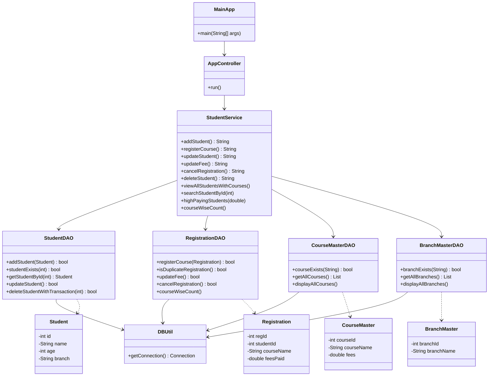

# 🎓 Student Course Registration & Fee Management System

## 🚀 Overview

A robust **Java console-based application** built using **JDBC and layered architecture** to manage student registrations, course enrollments, and fee transactions efficiently.

The system ensures **data integrity, validation, and transactional consistency**, making it suitable for real-world training institute scenarios.

---

## 🏗️ Architecture

This project follows a clean layered architecture:

```
Presentation Layer  →  AppController + InputUtil + Validator
Business Logic      →  StudentService
Data Access Layer   →  StudentDAO, RegistrationDAO, CourseMasterDAO, BranchMasterDAO
Utility Layer       →  DBUtil
Database            →  MySQL
```

---

## 🗂️ Class Diagram



---

## ✨ Features

### 👨‍🎓 Student Management
- Add new student with branch validation
- Prevent duplicate student IDs
- Update student details (name, branch)
- Delete student with cascading transaction
- Search student by ID

### 📚 Course Registration
- Register student for predefined courses only
- Prevent duplicate course registration
- Cancel course registration

### 💰 Fee Management
- Update course fee with positive-value validation
- High-paying students report (filter by min fee)

### 📊 Reports & Queries
- View all students with courses (LEFT JOIN)
- Course-wise student count (GROUP BY)
- View all available courses and branches

---

## 🔐 Key Highlights

### ✅ Transaction Management
Atomic operations using `commit()` and `rollback()` — applied in:
- **Course Registration** → rolls back if insert fails
- **Student Deletion** → deletes registrations first, then student; fully rolls back if either step fails

### ✅ Input Validation
- Handles invalid inputs (text instead of number, empty fields)
- Prevents negative or zero fees
- All input reading is centralized in `InputUtil`

### ✅ Data Integrity
- Foreign key constraints enforced in MySQL
- Branch and course validated against master tables before every insert/update
- Duplicate registration prevention via `isDuplicateRegistration()`

### ✅ Clean Code Practices
- Strict separation of concerns across layers
- Reusable validation via `Validator` class
- Consistent naming conventions throughout

---

## 🧾 Database Schema

```sql
DROP DATABASE IF EXISTS training_institute;
CREATE DATABASE training_institute;
USE training_institute;

CREATE TABLE branch_master (
    branch_id   INT PRIMARY KEY AUTO_INCREMENT,
    branch_name VARCHAR(50) NOT NULL UNIQUE
);
-- =============================================
-- course_master table
-- Only courses listed here are valid
-- Student can register ONLY from this list
-- No branch restriction
-- =============================================
CREATE TABLE course_master (
    course_id   INT PRIMARY KEY AUTO_INCREMENT,
    course_name VARCHAR(50) NOT NULL UNIQUE,
    fees        DOUBLE      NOT NULL
);

-- =============================================
-- student table
-- No branch restriction — any branch allowed
-- =============================================
CREATE TABLE student (
    id     INT PRIMARY KEY,
    name   VARCHAR(50) NOT NULL,
    age    INT         NOT NULL,
    branch VARCHAR(50) NOT NULL
);

-- =============================================
-- registration table
-- course_name must exist in course_master (FK)
-- This FK is the DB-level enforcement
-- =============================================
CREATE TABLE registration (
    reg_id      INT PRIMARY KEY AUTO_INCREMENT,
    student_id  INT         NOT NULL,
    course_name VARCHAR(50) NOT NULL,
    fees_paid   DOUBLE      NOT NULL,
    FOREIGN KEY (student_id)  REFERENCES student(id),
    FOREIGN KEY (course_name) REFERENCES course_master(course_name)
);

-- =============================================
-- Pre-load available courses into course_master
-- These are the ONLY courses students can pick
-- =============================================
INSERT INTO course_master (course_name, fees) VALUES
('Java Programming',    8000),
('Data Structures',     7500),
('Web Development',     9000),
('Python ',       7000),
('DBMS', 6500),
('Machine Learning',    11000),       
('Networking',          6000),
('Cloud Computing',     9500),
('Cybersecurity',       10000),
('Android', 8500);

INSERT INTO branch_master (branch_name) VALUES
('CSE'),
('ECE'),
('MECH'),
('CIVIL'),
('MBA'),
('IT'),
('EEE');

select * from student;
```

---

## 🛠️ Technologies Used

- **Java** (Core, OOP)
- **JDBC** (MySQL Connector/J)
- **MySQL** Database
- **Layered Architecture** (Controller → Service → DAO)
- **Eclipse IDE**

---

## ▶️ How to Run

1. **Create the database**
```sql
CREATE DATABASE training_institute;
USE training_institute;
-- Run the schema above, then insert master data
```

2. **Update DB credentials** in `DBUtil.java`
```java
private static final String URL      = "jdbc:mysql://localhost:3306/training_institute";
private static final String USER     = "root";
private static final String PASSWORD = "your_password";
```

3. **Add MySQL JDBC driver** to your Eclipse build path
   > Right-click project → Build Path → Add External JARs → select `mysql-connector-j-x.x.x.jar`

4. **Run** `MainApp.java` as a Java Application

---

## 📂 Project Structure

```
com.project.app
│
├── app
│   └── MainApp.java
│
├── controller
│   ├── AppController.java
│   ├── InputUtil.java
│   └── Validator.java
│
├── service
│   └── StudentService.java
│
├── dao
│   ├── StudentDAO.java
│   ├── RegistrationDAO.java
│   ├── CourseMasterDAO.java
│   └── BranchMasterDAO.java
│
├── model
│   ├── Student.java
│   ├── Registration.java
│   ├── CourseMaster.java
│   └── BranchMaster.java
│
└── util
    └── DBUtil.java
```

---

## 📸 Sample Output

```
=============================================
   STUDENT COURSE REGISTRATION SYSTEM
=============================================

 1.  Add Student
 2.  Register for Course
 3.  View All Students with Courses
 4.  Search Student by ID
 5.  Update Student
 6.  Update Course Fee
 7.  Cancel Registration
 8.  Delete Student
 9.  High Paying Students Report
 10. Course-wise Student Count
--- Master Data ---
 11. View All Available Courses
 12. View All Available Branches
 13. Exit
=============================================
Enter choice: 2

Registration successful!
[Registration Transaction Committed]
```

---

## 🧠 Learning Outcomes

- Understanding JDBC and database interaction in Java
- Implementing transaction management (`commit` / `rollback`)
- Applying layered architecture design pattern
- Handling edge cases and input validation
- Writing clean, maintainable, and reusable code

---

## 📌 Author

**Your Name Here**  
B.Tech CSE | JDBC Mini Project
